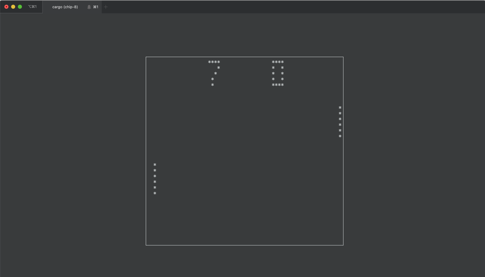

# chip-8



A simple [Rust](https://www.rust-lang.org/) implementation of a 
[Chip-8](https://en.wikipedia.org/wiki/CHIP-8) emulator.

It uses [EasyCurses](https://github.com/Lokathor/easycurses-rs), which is built on
[pancurses](https://github.com/ihalila/pancurses), for display,
keyboard input, and sound, so any platform that EasyCurses/pancurses run on, this should
as well.

## Building

```bash
cargo build
```

## Running

```bash
Usage: chip-8 [options] ROM

Options:
    -d, --debug         display debug info
    -h, --help          display this help message
```

## ROMs

Searching for "chip-8 roms" yields many links to various ROMs that should run on this
emulator. I used [this test ROM](https://github.com/corax89/chip8-test-rom), which exercises
the various features of the Chip-8. I also tested with [PONG](https://github.com/eejdoowad/Chip8/blob/master/roms/PONG),
[PONG2](https://github.com/eejdoowad/Chip8/blob/master/roms/PONG2), and 
[INVADERS](https://github.com/eejdoowad/Chip8/blob/master/roms/INVADERS).

Here are two sites with public domain ROMs:

* [Zophar's Domain](https://www.zophar.net/pdroms/chip8.html)
* [dmatlack/chip8](https://github.com/dmatlack/chip8/tree/master/roms)

## Reference Documents

* [Wikipedia: Chip-8](https://en.wikipedia.org/wiki/CHIP-8)
* [Cowgod's Chip-8 Technical Reference](http://devernay.free.fr/hacks/chip8/C8TECH10.HTM)
* [An Easy Programming System, Byte Magazine, December, 1978](https://archive.org/stream/byte-magazine-1978-12/1978_12_BYTE_03-12_Life#page/n109/mode/2up)
* [Mastering Chip-8](http://mattmik.com/files/chip8/mastering/chip8.html)
* [How to write a Chip-8 Interpreter](http://www.multigesture.net/articles/how-to-write-an-emulator-chip-8-interpreter/)
* [Writing a CHIP-8 emulator with Rust and WebAssembly](https://blog.scottlogic.com/2017/12/13/chip8-emulator-webassembly-rust.html)
* [Introduction to Chip-8](http://www.emulator101.com/introduction-to-chip-8.html)

## Inspirational Projects

* [danirod/chip8](https://github.com/danirod/chip8)
* [eejdoowad/Chip8](https://github.com/eejdoowad/Chip8)
* [JamesGriffin/CHIP-8-Emulator](https://github.com/JamesGriffin/CHIP-8-Emulator)
